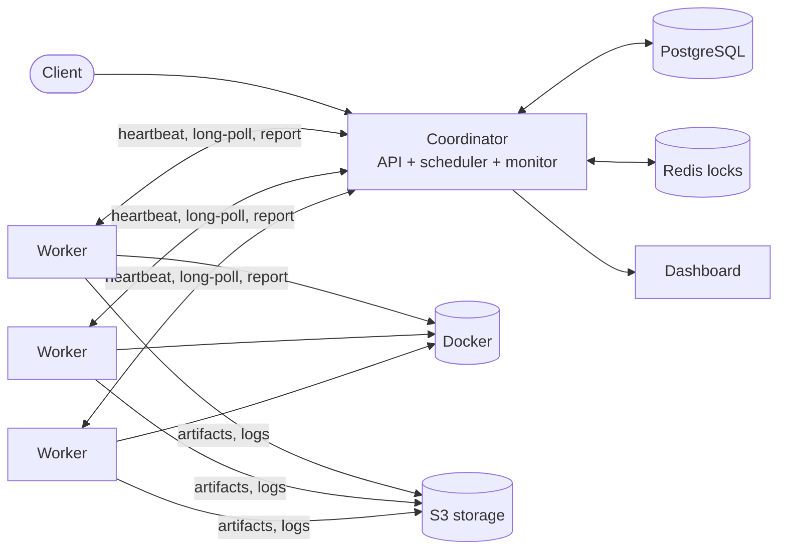

# Foreman

Foreman is a distributed job scheduler. You submit a container image and a command; Foreman places the job on a worker with enough free CPU and memory, runs it in a locked-down Docker container, and keeps logs, artifacts and a full event history. It recovers jobs when workers or coordinators die.

Stack: a TypeScript coordinator (REST, WebSocket, scheduler, monitor), TypeScript Docker workers, a Next.js dashboard, PostgreSQL, Redis, and S3-compatible storage.

**Live demo:** [foreman.naman.sbs](https://foreman.naman.sbs). Explore the dashboard and run guided jobs in **Try it live**, no account needed. Deployment notes are in [docs/PRODUCTION_DEPLOYMENT.md](docs/PRODUCTION_DEPLOYMENT.md).



The design, job state machine, failure-mode table and API summary are in [docs/ARCHITECTURE.md](docs/ARCHITECTURE.md).

## What it does

- **Resource-aware scheduling** with priorities, CPU/memory accounting, per-worker parallelism limits and label selectors (`{"selector": {"gpu": "true"}}`).
- **Fault tolerance.** Heartbeats mark silent workers unhealthy (15s) then offline (30s); their jobs are requeued, or failed once retries run out. Workers that come back are revived by their next heartbeat. Several coordinators can run at once without double-assigning a job.
- **Retries with exponential backoff** for failures and timeouts, plus cancellation of queued and running jobs.
- **Per-worker credentials.** The shared secret only registers a worker; everything after uses that worker's own token.
- **Isolated execution.** Job containers get no network, no capabilities, a read-only root filesystem, a PID limit, and memory and CPU limits. Containers orphaned by a crashed worker are swept up.
- **Logs and artifacts.** Output written to `/output` is uploaded as a tarball; stdout and stderr are stored and readable through the API and dashboard.
- **Live dashboard** over WebSocket (fed by PostgreSQL `NOTIFY`, so every coordinator replica sees every change), with polling as a fallback.
- **Operations.** Structured JSON logs, a dependency-checked `/health`, Prometheus `/metrics`, data retention, tracked migrations, nightly backups, and automatic rollback on a failed deploy.

## Run it

Requirements: Docker Desktop with a running Linux engine.

```bash
docker compose up -d --build
```

Compose starts PostgreSQL, Redis and MinIO, applies the migrations, then starts one coordinator, three workers and the dashboard. Open http://localhost:3000; the API is at http://localhost:8080. Set `API_PORT` or `DASHBOARD_PORT` in `.env` to change ports, and `MINIO_PUBLIC_ENDPOINT` to the address users can reach for artifact downloads (see [.env.example](.env.example) for every setting).

```bash
docker compose ps
docker compose logs -f coordinator worker dashboard
docker compose down        # keeps the data volumes
```

The dashboard and the guided demo need no sign-in. The public demo API accepts only five fixed scenarios, rate-limits per visitor and globally, and never exposes worker IDs or host paths. The private API uses `COORDINATOR_SECRET`; set your own value in `.env` before sharing a deployment.

Try the private API:

```bash
TOKEN=$(curl -s localhost:8080/auth/login -H 'content-type: application/json' \
  -d '{"api_key":"dev-secret-change-in-prod"}' | jq -r .token)
curl -s localhost:8080/jobs -H "authorization: Bearer $TOKEN" -H 'content-type: application/json' \
  -d '{"image_name":"alpine:3.20","command":"echo hello; echo hi > /output/hi.txt","priority":8,"max_retries":1}'
```

## Test

```bash
npm --prefix node/coordinator ci && npm --prefix node/coordinator test
npm --prefix node/worker ci && npm --prefix node/worker test
node scripts/node-smoke.mjs          # against a running `docker compose up` stack
```

- **Unit tests** cover routing, auth, scheduling, monitoring, the worker runtime and the Docker executor with fakes.
- **Integration tests** run the coordinator's real SQL (priority order, retry backoff, cancellation, recovery, pruning, `NOTIFY`). They are skipped unless `FOREMAN_TEST_DATABASE_URL` points at an empty, disposable PostgreSQL database; CI provides one. Set `FOREMAN_TEST_EMBEDDED=1` when using an embedded Postgres such as PGlite.
- **The smoke test** drives the whole stack: login, scheduling, success, failure with retry and backoff, timeout, logs, artifact download, cancellation, WebSocket updates and concurrent jobs. CI runs it on every push before deploying.

## Benchmarks

The scripts in [scripts](scripts) measure the system rather than assume it works:

| Script | Measures |
| --- | --- |
| `benchmark.py` | Throughput and per-job latency by worker count, orphan recovery after a worker is killed, and that an unplaceable job stays queued. |
| `bench_faults.py` | Time to recover from a killed worker, duplicate executions across two coordinators (ground truth via a beacon each job calls), scheduling latency, and capacity under bursts. |

Run the fault benchmarks against a two-coordinator stack:

```bash
docker compose -f docker-compose.yml -f docker-compose.bench.yml up -d --build
python scripts/bench_faults.py duplicates --jobs 500 --url http://localhost:8080 --url http://localhost:8081
python scripts/bench_faults.py recovery --runs 3
```

Results depend on the host, so none are quoted here. Run the commands above and record yours with the commit and machine they came from.

## Layout

| Path | Contents |
| --- | --- |
| `node/shared` | The API types, defined once and synced into each package (`node scripts/sync-shared-types.mjs`) |
| `node/coordinator` | API server, scheduler, monitor, stores, tests |
| `node/worker` | Registration, heartbeat, Docker executor, uploader, tests |
| `dashboard` | Next.js UI |
| `migrations` | SQL schema; `deploy/migrate.sh` applies each file once |
| `deploy` | Production Caddyfile, CI deploy with rollback, backup and restore scripts |
| `docs` | Architecture, production runbook, migration history |

`make up`, `make test`, `make build` and `make smoke` wrap the common commands. The history of the move from Go to TypeScript is in [docs/NODE_MIGRATION.md](docs/NODE_MIGRATION.md).
