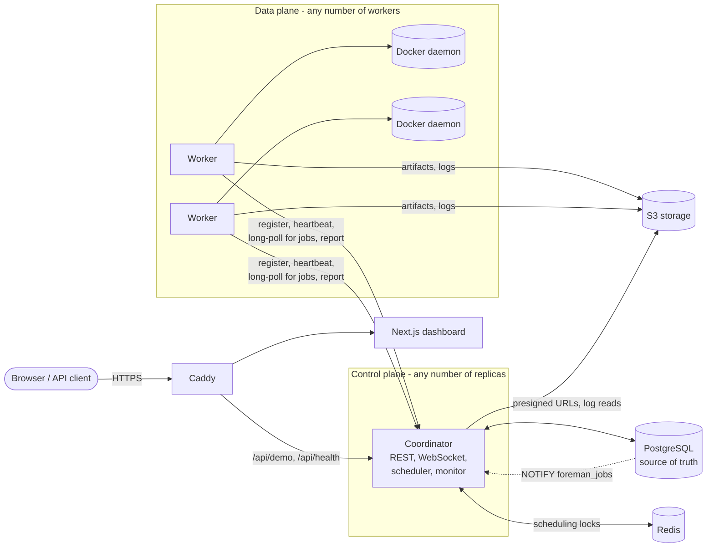
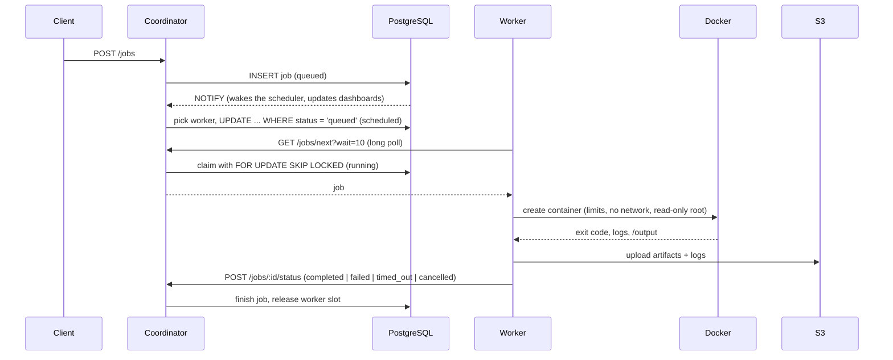
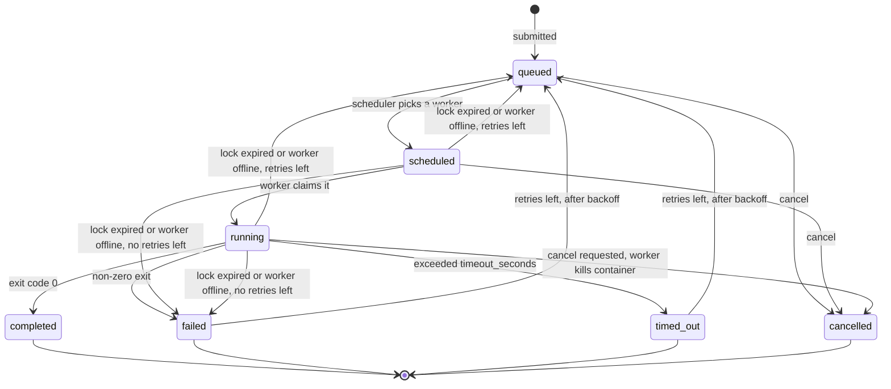

# Architecture

Foreman is a small distributed job scheduler. Clients submit a container image and a command; the system places the job on a worker with enough free CPU and memory, runs it in an isolated Docker container, and records logs, artifacts and every state change. It keeps working when workers or coordinators die.

## Components

| Component | Responsibility |
| --- | --- |
| Coordinator (`node/coordinator`) | HTTP API, WebSocket fan-out, scheduler loop, heartbeat monitor. Stateless apart from login sessions, so several can run side by side. |
| Worker (`node/worker`) | Registers with its CPU, memory and labels, heartbeats every 5s, long-polls for assigned jobs, runs each in a Docker container, uploads output and logs, reports the result. |
| PostgreSQL | The only source of truth: jobs, workers, events. All state changes are single guarded statements or short transactions. |
| Redis | A 30s `SET NX` lock per job so two schedulers do not even attempt the same assignment. Optional for correctness: the database guard is authoritative. |
| S3-compatible storage | Artifact tarballs (`artifacts/<job>.tar`) and logs (`logs/<job>.txt`). |
| Dashboard (`dashboard`) | Next.js UI over the public demo API and WebSocket. |

The API data model (`Job`, `Worker`, events) is defined once in `node/shared/types.ts`; `node scripts/sync-shared-types.mjs` copies it into the coordinator, worker and dashboard (each builds from its own Docker context), and CI fails if a copy is stale.

## Life of a job

### State machine

Scheduling rules:

- **Order.** Highest `priority` (1-10) first, then oldest. A job in retry backoff (`run_after` in the future) is skipped, not blocking those behind it.
- **Placement.** A worker must be `online`, have the free CPU and memory the job requests, be below `MAX_PARALLEL_JOBS_PER_WORKER`, and carry every label in the job's `selector`. Among eligible workers the one with the most headroom wins (`0.4*freeCPU + 0.4*freeMemory - 0.2*load`).
- **Retries.** A failure or timeout consumes a retry and requeues the job after `min(300, 5 * 2^retries)` seconds. A job recovered from a dead worker also consumes a retry.
- **Cancellation.** Queued and scheduled jobs cancel immediately. A running job gets `cancel_requested`; the next heartbeat response tells its worker to kill the container, and the worker reports `cancelled`.

## Failure modes

| Failure | What happens |
| --- | --- |
| Worker crashes mid-job | Heartbeats stop. After 15s the worker is `unhealthy`, after 30s `offline`, and the monitor requeues its jobs (or fails them when retries are exhausted). The orphaned container is removed by any worker's sweeper once it is a minute past the job's timeout. |
| Worker is partitioned but alive | Its jobs are recovered elsewhere. Its late status report is rejected because the job is no longer `running` on that worker. When connectivity returns, its next heartbeat sets it back to `online`. |
| Worker restarts | It re-registers with the ID saved in `~/.foreman/worker_id`, so it reuses its row. Container workers without a persisted ID get a new row; the old one is deleted after 24h offline. |
| Coordinator crashes | Other replicas keep serving. On startup the monitor immediately recovers anything whose lock expired while no coordinator was watching. |
| Two schedulers see the same job | The Redis lock and, authoritatively, `UPDATE ... WHERE status = 'queued'` let exactly one assignment succeed. |
| Redis is down | The scheduler logs a warning and relies on the database guard alone. |
| PostgreSQL is down | `/health` returns 503 and requests fail with 500. Workers keep running their containers and keep retrying heartbeats, but a result that cannot be reported is not re-sent: the job is recovered later through lock expiry and consumes a retry. The NOTIFY listener reconnects on its own. |
| Job exceeds its timeout | The container gets a 10s graceful stop, then a kill. The job is reported `timed_out` and consumes a retry. |
| Job floods stdout | The Docker log driver is capped at 1MB; the worker keeps at most the last 512KB per stream. |
| Object storage is down | The job result is still reported; the upload failure is logged, artifacts are missing, and logs stay on the worker. |
| Hostile job code | Containers run with no network by default, all capabilities dropped, `no-new-privileges`, a read-only root filesystem, a PID limit, and memory and CPU limits. |

## API summary

| Route | Auth | Purpose |
| --- | --- | --- |
| `POST /auth/login` | none (rate limited) | Exchange `COORDINATOR_SECRET` for a 24h session token. |
| `POST /workers/register` | shared secret | Returns the worker plus its own `token`. Passing a saved `worker_id` reuses that worker and rotates its token. |
| `POST /workers/heartbeat`, `GET /jobs/next`, `POST /jobs/:id/status` | worker token | Worker protocol; the token must belong to the `worker_id` in the request. Heartbeat responses carry `cancel_jobs`. `GET /jobs/next?wait=N` long-polls up to 25s. |
| `POST /jobs`, `GET /jobs`, `GET /jobs/:id` | session | Submit (with optional `selector`, `priority`, `max_retries`), list, inspect. |
| `POST /jobs/:id/cancel` | session | Cancel a job: 202 on success, 409 if already finished. |
| `GET /jobs/:id/logs`, `GET /jobs/:id/artifacts` | session | Last 256KB of logs as text; presigned artifact download. |
| `GET /workers`, `GET /metrics/summary` | session | Fleet and queue overview. |
| `GET /ws` | session token | Live `job_updated`, `worker_registered`, `worker_heartbeat` events. |
| `/demo/*` | none | Fixed demo scenarios, sanitized jobs and workers, demo-only cancel and logs. Rate limited per visitor, globally and by queue depth. |
| `GET /health`, `GET /metrics` | none | Dependency-checked health; Prometheus metrics. |

## Configuration

| Variable | Default | Used by |
| --- | --- | --- |
| `COORDINATOR_SECRET` | required | coordinator, workers |
| `MAX_PARALLEL_JOBS_PER_WORKER` | 4 | scheduler |
| `RETENTION_DAYS` | 30 (0 = keep) | monitor, bucket lifecycle |
| `PUBLIC_DEMO_ENABLED`, `TRUST_PROXY` | false | coordinator |
| `WORKER_CPU_CORES`, `WORKER_MEMORY_MB`, `WORKER_MAX_PARALLEL_JOBS` | 2, 1024, 4 | worker |
| `WORKER_LABELS` | empty | worker (`region=eu,gpu=true`) |
| `WORKER_JOB_NETWORK` | `none` | worker (`bridge` allows outbound access) |
| `FOREMAN_DATA_DIR` | OS temp dir | worker scratch space |

## Known limits

- Workers need the Docker socket, which is root-equivalent on the host. Treat worker hosts as trusted infrastructure; the container hardening protects the host from job code, not from a compromised worker.
- Workers authenticate in two steps. The shared `COORDINATOR_SECRET` is used only to register; the coordinator then issues that worker its own random token (stored as a hash), and heartbeats, job claims and status reports must present the token of the worker they name. A leaked worker token cannot act as any other worker, but anyone holding the shared secret can still register workers, and re-registering a worker ID rotates its token and locks out the previous holder. Workers re-register automatically if their token is rejected.
- Dashboard login sessions are in coordinator memory, so they do not survive a restart or move between replicas. The public demo does not use them.
- Logs are available after a job finishes; there is no live tailing yet.
- Cancellation of a running job takes up to one heartbeat interval (5s).
