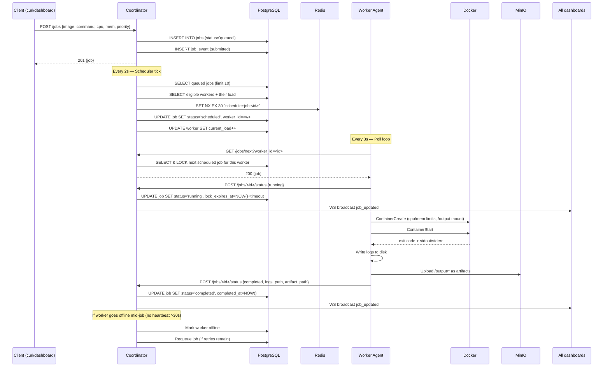

# Foreman — Full Project Guide & Architecture

> A fault-tolerant distributed task execution engine: you submit a Docker-based job, Foreman figures out which worker machine to run it on, runs it in a container, captures logs and artifacts, and recovers automatically from crashes.

---

## 1. What Problem Does It Solve?

You have a pool of machines (workers) and a backlog of tasks (jobs). Each job needs a Docker image, a shell command, some CPU/RAM, and a time limit. Foreman:
- Accepts job submissions over a REST API
- Picks the best worker for each job (resource-aware, scored)
- Runs the job inside a Docker container on the chosen worker
- Captures stdout/stderr and file artifacts
- Handles crashes: if a worker dies mid-job, the job gets re-queued automatically
- Shows everything in a real-time web dashboard

---

## 2. High-Level Architecture

```
  [Browser Dashboard / curl / scripts]
              │
              │  REST + WebSocket
              ▼
  ┌─────────────────────────────────────┐
  │          COORDINATOR (Go)            │
  │                                     │
  │  ┌─────────┐  ┌──────────────────┐  │
  │  │  REST   │  │  WebSocket Hub   │  │
  │  │  API    │  │  (broadcasts to  │  │
  │  │  (chi)  │  │   all dashboards)│  │
  │  └────┬────┘  └──────────────────┘  │
  │       │                             │
  │  ┌────▼────────┐  ┌──────────────┐  │
  │  │ Scheduler   │  │   Monitor    │  │
  │  │ (2s tick)   │  │ (5s tick)    │  │
  │  └─────────────┘  └──────────────┘  │
  └──────────────┬──────────────────────┘
                 │
         ┌───────┴────────┐
         │   PostgreSQL    │  ← jobs, workers, events
         └───────┬────────┘
                 │
         ┌───────┴────────┐
         │     Redis       │  ← per-job lock (SET NX EX)
         └───────┬────────┘
                 │
    ┌────────────┴──────────────┐
    │   Worker Agent (Go) × N   │
    │                           │
    │  registers on startup     │
    │  heartbeat every 5s       │
    │  polls /jobs/next (3s)    │
    │  runs Docker container    │
    │  uploads artifacts → MinIO│
    └───────────────────────────┘
```

---

## 3. Component-by-Component Breakdown

### 3.1 Coordinator ([cmd/coordinator/main.go](file:///c:/Users/naman/OneDrive/Desktop/main-projects/Foreman/cmd/coordinator/main.go))

**The entry point.** Wires everything together and starts all background goroutines.

| What it does | How |
|---|---|
| Connects to PostgreSQL | `pgxpool.New()` |
| Connects to Redis | `redis.NewClient()` |
| Optionally connects to MinIO | Only if `MINIO_ENDPOINT` env is set |
| Starts the WebSocket Hub | `go hub.Run(ctx)` |
| Starts the Monitor | `go mon.Run(ctx)` |
| Starts the Scheduler | `go sched.Run(ctx)` |
| Starts the HTTP server | `http.ListenAndServe()` on port 8080 |
| Handles graceful shutdown | `signal.NotifyContext` for SIGTERM/SIGINT |

---

### 3.2 REST API (`internal/api/`)

**6 files that form the HTTP layer:**

| File | What it does |
|---|---|
| `router.go` | Wires all routes using **chi** router. Splits routes into 3 groups: _Public_ (health, login), _Worker auth_ (pre-shared secret), _Dashboard auth_ (session token). Also defines `Handler` struct holding store, artifact store, WebSocket hub, and session store. |
| `auth.go` | `POST /auth/login` — takes an API key, validates it against `COORDINATOR_SECRET`, returns a random 24-hour session UUID. `SessionStore` is an in-memory map. Two auth middlewares: one for workers (checks `Authorization: Bearer <secret>`), one for the dashboard (checks session token). |
| `jobs.go` | All job-related handlers: submit job, list jobs, get single job + its event timeline, poll next job (for workers), update job status (called by workers when they start/finish a job), get artifact pre-signed URL. |
| `workers.go` | `registerWorker` — stores worker hostname + CPU/RAM in DB, returns UUID. `workerHeartbeat` — updates `last_heartbeat` + current load. `listWorkers` — returns all workers for the dashboard. |
| `hub.go` | WebSocket Hub. Maintains a set of connected clients. `Broadcast()` pushes a JSON event to all of them. Three event types: `job_updated`, `worker_heartbeat`, `worker_registered`. |
| `metrics.go` | `GET /metrics/summary` — returns job counts grouped by status (queued, running, completed, failed, etc.). |

---

### 3.3 Scheduler (`internal/scheduler/scheduler.go`)

**Runs every 2 seconds** in a background goroutine. Picks queued jobs and assigns them to workers.

#### Algorithm (3 steps per batch):

**Step 1 — Filter**
```
worker.status == "online"
available_cpu    >= job.required_cpu
available_memory >= job.required_memory
current_load     <  MAX_PARALLEL_JOBS_PER_WORKER
```
`available_cpu/memory` = total − sum of already-scheduled/running jobs (not just a counter).

**Step 2 — Score** (higher = better worker)
```
score = 0.4 × (free_cpu / total_cpu)
      + 0.4 × (free_mem / total_mem)
      − 0.2 × (load     / max_parallel)
```

**Step 3 — Atomic assignment**
```
Redis SET NX EX 30 "scheduler:job:<id>"        // distributed lock
→ if acquired: UPDATE jobs SET status='scheduled' WHERE status='queued'
               UPDATE workers SET current_load++
→ if not acquired: skip (another coordinator instance grabbed it)
```
After assigning, the scheduler **updates its local in-memory copy** of the worker's resources so subsequent jobs in the same 2s batch see correct headroom without extra DB queries.

---

### 3.4 Monitor (`internal/monitor/monitor.go`)

**Runs every 5 seconds** (and immediately on startup). Two responsibilities:

#### Heartbeat Detection
```
> 15s since last heartbeat → worker = "unhealthy"
> 30s since last heartbeat → worker = "offline", current_load = 0
  → RecoverJobsForWorkers(offline_ids)
```

#### Job Recovery (stale lock scan)
```
SELECT running/scheduled jobs WHERE lock_expires_at < NOW()
  retries + 1 <= max_retries  → status = "queued",  worker_id = NULL
  retries + 1 >  max_retries  → status = "failed",  completed_at = NOW()
  emit job_event: "auto_recovered" | "auto_failed"
```

Running **on startup** means coordinator restarts don't abandon stuck jobs — they get requeued before new workers connect.

---

### 3.5 Worker Agent (`cmd/worker/`, `internal/worker/`)

**Runs as a separate process (or container) on each machine.**

#### Lifecycle (`cmd/worker/main.go`):
1. **Register** — POST `/workers/register` with hostname + CPU + RAM → gets a UUID
2. **Heartbeat loop** — POST `/workers/heartbeat` every 5s with current load
3. **Poll loop** — GET `/jobs/next?worker_id=<id>` every 3s
4. On job received → spawn a goroutine → **Execute** → **Upload artifacts** → **Report status**

#### Executor (`internal/worker/executor.go`):
- Pulls Docker image if not cached (`ensureImage`)
- Creates container with **enforced CPU and RAM limits**
- Mounts a host directory as `/output` (artifact dir)
- Runs `sh -c <command>` with a `context.WithTimeout`
- Captures stdout/stderr, writes to `<tmpdir>/foreman/jobs/<id>/logs.txt`
- Cleans up container on exit (even on error)
- Returns `ExecResult` with exit code, logs path, artifact dir, duration

#### Uploader (`internal/worker/uploader.go`):
- Walks the job's artifact directory
- Uploads each file to MinIO under key `jobs/<jobID>/<filename>`
- Returns the MinIO object key for the coordinator to store

#### Client (`internal/worker/client.go`):
- Typed HTTP client for coordinator communication
- Methods: `Register`, `Heartbeat`, `PollJob`, `ReportStatus`
- All requests send `Authorization: Bearer <COORDINATOR_SECRET>`

---

### 3.6 Data Store (`internal/store/`)

Raw SQL via `pgx/v5` (no ORM).

| File | What it covers |
|---|---|
| `store.go` | `Store` struct wrapping `*pgxpool.Pool` |
| `jobs.go` | `CreateJob`, `ListJobs`, `GetJob`, `UpdateJobStatus`, `GetNextJob` (FOR UPDATE SKIP LOCKED), `AssignJob` |
| `workers.go` | `CreateWorker`, `UpdateHeartbeat`, `ListWorkers`, `GetEligibleWorkersWithLoad` |
| `scheduler.go` | `GetQueuedJobs`, `AssignJob` (atomic: checks `WHERE status='queued'` as DB-level guard) |
| `monitor.go` | `MarkWorkersUnhealthy`, `MarkWorkersOffline`, `RecoverJobsForWorkers`, `RecoverStaleJobs` |
| `events.go` | `CreateJobEvent`, `GetJobEvents` |
| `artifacts.go` | `ArtifactStore` interface + `MinioArtifactStore` implementation (`GetPresignedURL`) |

**`FOR UPDATE SKIP LOCKED`** is used in `GetNextJob` so multiple workers polling simultaneously never claim the same job.

---

### 3.7 Models (`internal/models/`)

Shared Go structs used across all packages:

```go
type Worker struct {
  ID, Hostname, Status string
  CPUCores, MemoryMB   int
  LastHeartbeat         time.Time
  CurrentLoad           int
}

type Job struct {
  ID, Name, Status        string
  ImageName, Command       string
  RequiredCPU, RequiredMem int
  Priority                 int  // 1=highest, 10=lowest
  Retries, MaxRetries      int
  TimeoutSeconds           int
  ArtifactPath, LogsPath   *string
  WorkerID                 *uuid.UUID
  LockExpiresAt            *time.Time
}

type JobEvent struct {
  ID, JobID, EventType string
  Timestamp            time.Time
  Metadata             json.RawMessage
}
```

---

### 3.8 Dashboard (`dashboard/`)

**Next.js 15 app** (TypeScript, Tailwind CSS, TanStack Query, Recharts).

| File / Directory | What it does |
|---|---|
| `src/app/page.tsx` | **Overview page** — stat cards (total/running/queued/completed/failed), bar chart of jobs by status, live worker fleet panel with load bars |
| `src/app/jobs/` | Jobs list page (filterable by status) + job detail page (event timeline, artifact download) |
| `src/app/workers/` | Workers list with status, CPU/RAM, load |
| `src/app/login/page.tsx` | Login form — calls `POST /auth/login`, stores token in `localStorage` |
| `src/lib/api.ts` | All API calls. Token stored in `localStorage`. Auto-redirects to `/login` on 401. `wsUrl()` builds the WebSocket URL with token as query param. |
| `src/lib/types.ts` | TypeScript interfaces for `Job`, `Worker`, `JobEvent`, `MetricsSummary`, `WSEvent` |
| `src/hooks/useWebSocket.ts` | Custom hook — connects to `/ws`, reconnects on disconnect, calls a user-provided callback on each event |
| `src/app/providers.tsx` | Wraps app in `QueryClientProvider` (TanStack Query) |

**Real-time strategy**: WebSocket is primary (`job_updated`, `worker_heartbeat`, `worker_registered` events invalidate TanStack Query caches); 10s polling is the fallback.

---

## 4. Database Schema

```sql
-- Workers: one row per registered worker agent
CREATE TABLE workers (
  id                    UUID PRIMARY KEY,
  hostname              TEXT NOT NULL,
  status                TEXT NOT NULL,          -- online | busy | offline | unhealthy
  last_heartbeat        TIMESTAMPTZ,
  cpu_cores             INT,
  memory_mb             INT,
  labels                JSONB DEFAULT '{}',
  current_load          INT DEFAULT 0,
  registered_token_hash TEXT,                   -- SHA-256 of the secret used at registration
  registered_at         TIMESTAMPTZ DEFAULT NOW()
);

-- Jobs: one row per submitted job
CREATE TABLE jobs (
  id               UUID PRIMARY KEY,
  name             TEXT,
  status           TEXT NOT NULL,               -- queued → scheduled → running → completed/failed/timed_out/cancelled
  submitted_at     TIMESTAMPTZ DEFAULT NOW(),
  scheduled_at     TIMESTAMPTZ,
  started_at       TIMESTAMPTZ,
  completed_at     TIMESTAMPTZ,
  retries          INT DEFAULT 0,
  max_retries      INT DEFAULT 2,
  timeout_seconds  INT DEFAULT 300,
  required_cpu     INT DEFAULT 1,
  required_memory  INT DEFAULT 256,
  worker_id        UUID REFERENCES workers(id),
  image_name       TEXT NOT NULL,
  command          TEXT NOT NULL,
  logs_path        TEXT,
  artifact_path    TEXT,
  lock_expires_at  TIMESTAMPTZ,                 -- coordinator crash recovery anchor
  priority         INT DEFAULT 5               -- 1 = highest, 10 = lowest
);

-- Job events: audit trail / timeline
CREATE TABLE job_events (
  id          UUID PRIMARY KEY,
  job_id      UUID REFERENCES jobs(id),
  event_type  TEXT NOT NULL,  -- submitted | status_changed | auto_recovered | auto_failed
  timestamp   TIMESTAMPTZ DEFAULT NOW(),
  metadata    JSONB DEFAULT '{}'
);
```

---

## 5. Job Lifecycle (End-to-End Flow)



---

## 6. Authentication

| Actor | Token | How |
|---|---|---|
| Worker | `COORDINATOR_SECRET` (static) | Sent as `Authorization: Bearer <secret>` on every request. SHA-256 hash stored in `registered_token_hash`. |
| Dashboard | Session UUID | `POST /auth/login` with API key → gets a 24h session UUID. Stored in `localStorage`. Sent as `Authorization: Bearer <token>`. |
| WebSocket | Same session UUID | Passed as `?token=<uuid>` query param (browser WS API doesn't support custom headers). |

---

## 7. Infrastructure (`docker-compose.yml`)

| Service | Port | Purpose |
|---|---|---|
| `postgres` | 5432 | Primary database |
| `redis` | 6379 | Distributed job lock |
| `minio` | 9000 (API) / 9001 (Console) | Artifact object storage |

---

## 8. File Map (Where Everything Lives)

```
Foreman/
├── cmd/
│   ├── coordinator/main.go     ← Start coordinator: wires DB, Redis, MinIO, HTTP, scheduler, monitor
│   └── worker/main.go         ← Start worker: register, heartbeat loop, poll loop, execute
│
├── internal/
│   ├── api/
│   │   ├── router.go          ← chi router, route groups, CORS, middleware
│   │   ├── auth.go            ← /auth/login, session store, auth middlewares
│   │   ├── jobs.go            ← submit, list, get, nextJob, updateStatus, getArtifacts
│   │   ├── workers.go         ← register, heartbeat, listWorkers
│   │   ├── hub.go             ← WebSocket hub (broadcast to all dashboards)
│   │   ├── metrics.go         ← /metrics/summary handler
│   │   └── handlers.go        ← shared helpers (parseUUID etc.)
│   │
│   ├── scheduler/
│   │   └── scheduler.go       ← 2s tick, filter → score → Redis NX lock → assign
│   │
│   ├── monitor/
│   │   └── monitor.go         ← 5s tick, heartbeat detection, job recovery
│   │
│   ├── store/
│   │   ├── store.go           ← Store struct (wraps pgxpool)
│   │   ├── jobs.go            ← SQL for job CRUD + FOR UPDATE SKIP LOCKED
│   │   ├── workers.go         ← SQL for worker CRUD + heartbeat
│   │   ├── scheduler.go       ← SQL for queued jobs + atomic assignment
│   │   ├── monitor.go         ← SQL for health checks + recovery
│   │   ├── events.go          ← SQL for job_events
│   │   └── artifacts.go       ← MinioArtifactStore: upload + presigned URL
│   │
│   ├── worker/
│   │   ├── executor.go        ← Docker container lifecycle (pull, run, logs, cleanup)
│   │   ├── uploader.go        ← MinIO upload of /output artifacts
│   │   └── client.go          ← HTTP client for talking to coordinator
│   │
│   └── models/
│       └── models.go          ← Worker, Job, JobEvent structs + JobStatus constants
│
├── migrations/
│   ├── 000001_init_schema.up.sql    ← Creates workers, jobs, job_events tables
│   ├── 000001_init_schema.down.sql
│   ├── 000002_add_token_hash.up.sql ← Adds registered_token_hash column to workers
│   └── 000002_add_token_hash.down.sql
│
├── dashboard/src/
│   ├── app/
│   │   ├── page.tsx           ← Overview: stat cards + job status bar chart + worker fleet
│   │   ├── jobs/page.tsx      ← Filterable job list
│   │   ├── jobs/[id]/page.tsx ← Job detail: status, event timeline, artifact download
│   │   ├── workers/page.tsx   ← Worker list: CPU/RAM/load/status
│   │   ├── login/page.tsx     ← API key login form
│   │   ├── layout.tsx         ← App shell (sidebar nav)
│   │   └── providers.tsx      ← TanStack QueryClientProvider
│   ├── lib/
│   │   ├── api.ts             ← All fetch calls + token management + wsUrl()
│   │   ├── types.ts           ← TS interfaces for Job, Worker, JobEvent, WSEvent
│   │   └── utils.ts           ← Helpers (ago(), cn() etc.)
│   └── hooks/
│       └── useWebSocket.ts    ← WS connect/reconnect hook with event callback
│
├── scripts/
│   └── benchmark.py           ← Throughput + failure recovery benchmarks
│
├── Makefile                   ← make migrate, make run-coordinator, etc.
├── docker-compose.yml         ← Postgres + Redis + MinIO
├── Dockerfile.coordinator     ← Multi-stage Go build for coordinator
├── Dockerfile.worker          ← Multi-stage Go build for worker
└── .env.example               ← Required env vars template
```

---

## 9. Key Design Decisions & Tradeoffs

| Decision | Why |
|---|---|
| **Single coordinator** | Simpler ordering guarantee. Redis lock + `WHERE status='queued'` guard would still work with multiple instances. |
| **Worker polling (3s)** | Simpler than push; 3s lag is acceptable for a batch job system. |
| **`FOR UPDATE SKIP LOCKED`** | Multiple workers can poll simultaneously without blocking each other. |
| **Redis NX lock** | Second line of defence against double-assignment when Redis is available; DB guard is the fallback. |
| **In-memory session store** | Sessions lost on coordinator restart — acceptable for dashboard-only use. |
| **MinIO optional** | Coordinator starts fine without it; artifact endpoints just return 503. |
| **Lock extends to `timeout_seconds`** | Prevents monitor from falsely recovering a legitimately long-running job. |
